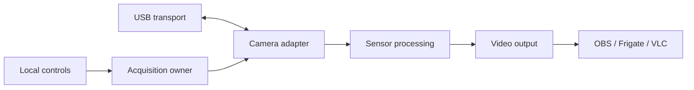

# Cam Action

Cam Action makes closed imaging devices useful to open software.

The first adapter reads a REVASRI R-T160 thermal camera over its proprietary
USB bulk protocol, performs the currently recovered sensor correction, and
publishes a normal H.264 RTSP stream. That stream can be consumed by OBS,
Frigate, VLC, FFmpeg, or another standard RTSP client.

This is an experimental project. The R-T160 path is working on macOS ARM64.
Windows 10/11 and Linux are intended targets but still need hardware testing.
The current image is relative thermal signal, not calibrated Celsius.



## What works today

- Direct USB acquisition without running the vendor application.
- R-T160 calibration-table retrieval and commanded shutter calibration.
- Relative per-pixel correction and three display palettes.
- Rotation, local preview, status JSON, and a validated control endpoint.
- H.264 over RTSP/TCP through FFmpeg and MediaMTX.
- Reconnect attempts and a black output after two seconds without fresh data.

The tested camera produces 160×120 sensor frames. Cam Action scales them to
640×480 for video output and maintains a 25 fps output clock. The camera itself
delivered roughly 19–22 fresh frames per second during the initial tests.

## Quick start

Install Python 3.10 or newer, NumPy, libusb 1.0, FFmpeg with `libx264`, and
[MediaMTX](https://mediamtx.org/docs/kickoff/install). From the repository root:

```sh
python -m venv .venv
# Activate .venv using your shell's normal command.
python -m pip install -e .
python run.py
```

If FFmpeg or MediaMTX is not on `PATH`:

```sh
python run.py --mediamtx /path/to/mediamtx --ffmpeg /path/to/ffmpeg
```

Set `LIBUSB_LIBRARY` to the complete libusb path when automatic discovery does
not find it. The launcher starts MediaMTX and Cam Action together; Ctrl-C
stops both. It does not install a system service.

| Interface | Default address |
| --- | --- |
| Preview and controls | <http://127.0.0.1:8787> |
| RTSP video | `rtsp://127.0.0.1:18554/thermal` |
| Status JSON | <http://127.0.0.1:8787/status> |

All listeners bind to loopback by default. Port 18554 avoids the commonly used
8554. To run only the service against an existing RTSP server:

```sh
cam-action --rtsp rtsp://127.0.0.1:18554/thermal
```

## OBS, YouTube, and Frigate

In OBS, add a Media Source, turn off Local File, and enter the RTSP address.
Use RTSP over TCP. OBS can record the feed or publish it to YouTube through
its normal YouTube/RTMPS settings; Cam Action needs no public-facing port.

Frigate can use the same RTSP URL. If Frigate runs in a container or on another
machine, `127.0.0.1` points to the wrong host. Expose MediaMTX deliberately on
an accessible interface, then configure authentication and firewall rules.
Keep the Cam Action control server on loopback. See
[operations](docs/OPERATIONS.md) for the example configuration.

## Architecture

Each concern has one home:

| Layer | Module | Responsibility |
| --- | --- | --- |
| Transport | `cam_action/transport.py` | libusb loading, handles, interface selection, bulk I/O |
| Camera adapter | `cam_action/camera.py` | Device IDs, endpoints, commands, framing, metadata, crop, timing |
| Processing | `cam_action/processing.py` | Reference correction, contrast, palette, orientation, PNG snapshots |
| Acquisition | `cam_action/service.py` | USB ownership, calibration scheduling, reconnects, latest-frame state |
| Video output | `cam_action/output.py` | FFmpeg H.264 publishing |
| Controls | `cam_action/control.py` | Local preview and validated command API |
| Launcher | `run.py` | MediaMTX and service lifecycle |

The `Transport` and `Camera` protocols are the adapter seams. A new camera
should get a new adapter rather than adding magic bytes or geometry to the
processing and output modules. A native virtual-camera implementation can be
added later as another output adapter. Android needs a USB-host integration;
iOS is intentionally low priority.

## Development

```sh
python -m pip install -e ".[dev]"
python -m unittest discover -s tests -v
python -m ruff check .
python -m ruff format --check .
python -m build
```

The normal tests are synthetic and require no camera, vendor application, or
network. Set `CAM_ACTION_TEST_CAPTURE` to a private development recording to
enable the optional hardware-session regression; captures are excluded from
Git. CI checks Python 3.10 and 3.13 on macOS, Linux, and Windows. CI passing
validates software behavior, not USB access on each platform.

- [Protocol notes](docs/PROTOCOL.md)
- [Architecture](docs/ARCHITECTURE.md)
- [Operations and platform setup](docs/OPERATIONS.md)
- [Validation record](docs/VALIDATION.md)
- [Roadmap](docs/ROADMAP.md)
- [Contributing](CONTRIBUTING.md)
- [Security](SECURITY.md)

Vendor APKs, native libraries, decompiled source, device serial numbers,
captured images, local logs, and downloaded server binaries are intentionally
excluded. Product names identify the hardware investigated; this is an
independent implementation.

## License

Cam Action is released under the MIT License. MIT grants broad permission to
use, copy, modify, and redistribute the work while retaining a small copyright
and warranty notice. A public-domain dedication sounds even simpler, but its
legal effect varies by jurisdiction and cannot always be guaranteed for every
contributor. MIT is the practical default here; contributors should make their
intent clear when submitting work.
