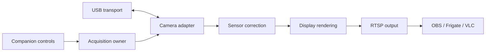

# Thermal Bridge

**Use a proprietary USB thermal camera as an RTSP video source.**

Thermal Bridge reads the camera directly, applies relative sensor correction, and publishes video for OBS, Frigate, VLC, and other RTSP clients. A local companion page provides a live preview, shutter calibration, rotation, and palettes.

**Status: experimental, working on macOS ARM64 with a REVASRI R-T160.** Windows 10/11 and Linux are intended targets, not yet hardware-validated. Output is relative thermal signal—not calibrated Celsius.



## What works

- Direct USB acquisition without running vendor software.
- Camera-specific calibration-table retrieval and commanded shutter calibration.
- White-hot, black-hot, and iron palettes; 0°/90°/180°/270° rotation.
- Local preview and control API.
- H.264 over RTSP/TCP through FFmpeg and MediaMTX.
- Bounded stale-frame display and reconnect attempts.

The tested camera produces a 160×120 image. The bridge enlarges it to 640×480 and publishes at 25 fps, repeating the latest image when necessary. Initial tests decoded approximately 19–22 fresh frames/second; capture is not yet lossless. Shutter timing remains provisional.

## Quick start

Install **Python 3.10+**, **libusb 1.0**, **FFmpeg with libx264**, and **[MediaMTX](https://mediamtx.org/docs/kickoff/install)** for your OS. Clone this repository and run from its root:

```sh
python -m venv .venv
# Activate .venv for your shell, then:
python -m pip install -e .
python run.py
```

If executables are not on PATH:

```sh
python run.py --mediamtx /path/to/mediamtx --ffmpeg /path/to/ffmpeg
```

Set `LIBUSB_LIBRARY` to the full path of the libusb library if discovery fails. The launcher runs both the RTSP server and the camera service; Ctrl-C stops both. No system service is installed. Hardware permissions and Windows driver binding are described in the [operations guide](docs/OPERATIONS.md).

| Interface | Default address |
|---|---|
| Preview and controls | http://127.0.0.1:8787 |
| RTSP video | `rtsp://127.0.0.1:18554/thermal` |
| Status JSON | http://127.0.0.1:8787/status |

All listeners default to loopback. Port 18554 avoids the commonly used 8554. To run just the camera service against an existing RTSP server:

```sh
thermal-bridge --rtsp rtsp://127.0.0.1:18554/thermal
```

## OBS and YouTube

In OBS, add a **Media Source**, disable **Local File**, and enter the RTSP address. Use RTSP-over-TCP. OBS can then record or publish to YouTube using its normal streaming settings; the bridge needs no public-facing ports. No virtual-camera driver is required.

## Frigate

Frigate can consume the RTSP feed. If Frigate is on another machine or in a container, localhost is not the camera host: configure an accessible MediaMTX listener and appropriate authentication/firewall rules. Keep the companion control API local.

See the [Frigate configuration example](docs/OPERATIONS.md#frigate). Providing a video feed does not imply that visible-light detection models will perform well on thermal imagery.

## Separate the hardware from the camera processing

| Layer | Module | Owns |
|---|---|---|
| Transport | `transport.py` | libusb handles and bulk I/O |
| Hardware adapter | `camera.py` | R-T160 IDs, endpoints, commands, packet framing, metadata, crop and timing |
| Processing | `processing.py` | Reference correction, contrast, palette, orientation |
| Orchestration | `service.py` | One acquisition owner, scheduling, latest frames, command queue |
| Video output | `output.py` | FFmpeg publishing, independent of hardware |
| Companion utility | `control.py` | Local preview and command API |

The `Transport` and `Camera` protocols are the adapter boundaries. Add another camera in its own adapter; do not spread its magic bytes or geometry through processing and output code. Native virtual cameras can be added as output adapters. Android needs its own USB host integration; iOS is low priority.

## Development and evidence

```sh
python -m pip install -e ".[dev]"
python -m unittest discover -s tests -v
python -m ruff check .
python -m ruff format --check .
python -m build
```

Normal tests are synthetic and need no camera. An optional recorded-hardware regression is enabled by `THERMAL_BRIDGE_TEST_CAPTURE`; recordings are deliberately excluded from Git. CI checks Python 3.10 and 3.13 on Windows, macOS, and Linux. CI passing validates software behavior, not USB access on those platforms.

- [Protocol observations](docs/PROTOCOL.md)
- [Operations and platform setup](docs/OPERATIONS.md)
- [Roadmap](docs/ROADMAP.md)
- [Contributing](CONTRIBUTING.md)
- [Deployment security](SECURITY.md)

Vendor APKs, native libraries, decompiled source, device serial numbers, captured images, local logs, and downloaded server binaries are not part of this repository. REVASRI and Camera+ names identify the hardware/software investigated; this is an independent project.
